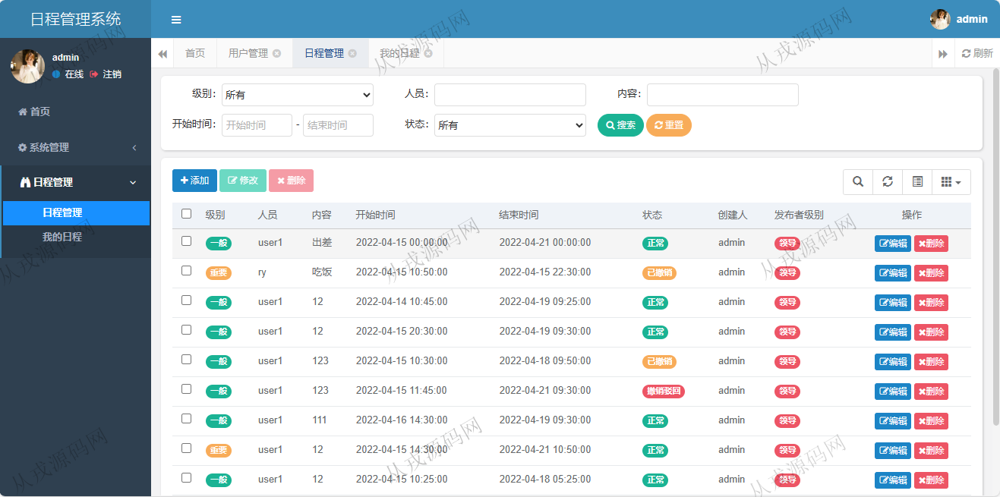
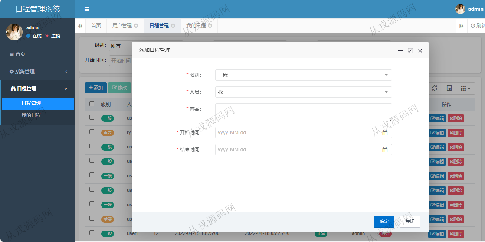
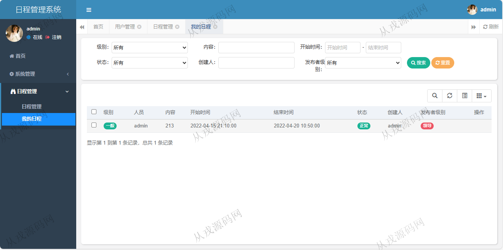
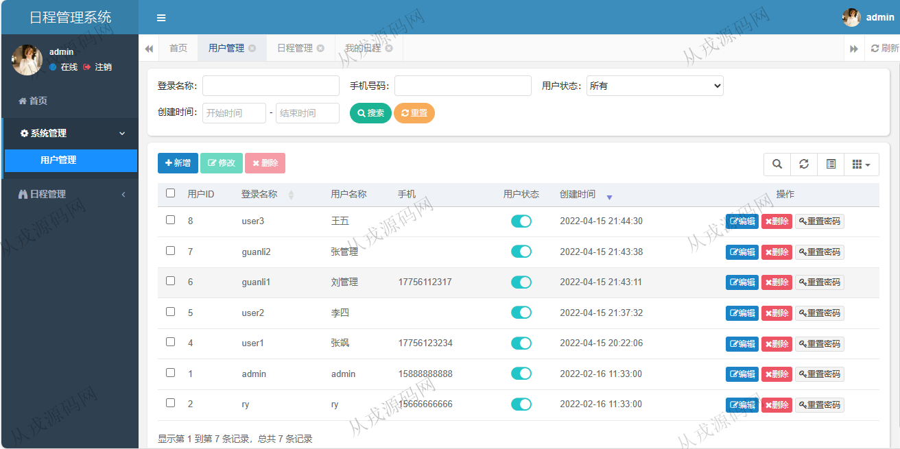
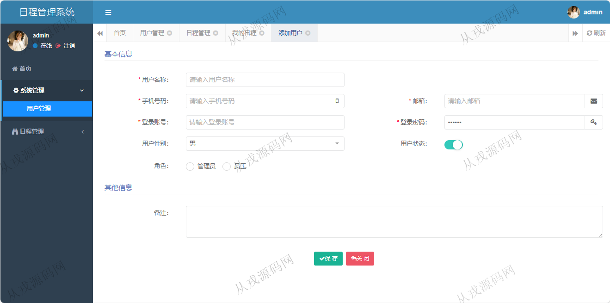
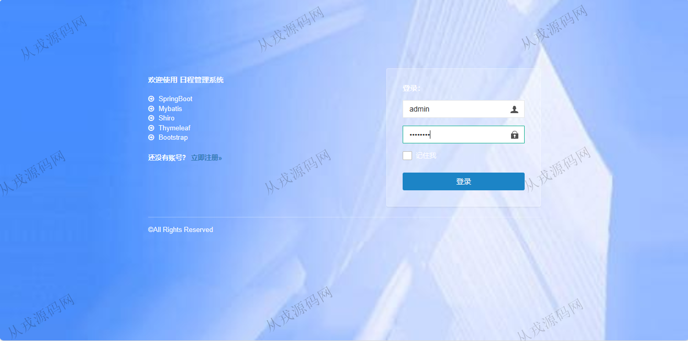

<h1 align="center">118.日程管理系统</h1>

 获取sql文件 QQ: 386869957 QQ群: 377586148 

 [推荐站点: 从戎源码网](https://armycodes.com/) 

## 简介

> 本代码来源于网络,仅供学习参考使用!
>
> 提供1.远程部署/2.修改代码/3.设计文档指导/4.框架代码讲解等服务
> 
> 访问地址: http://localhost:8080/index
>
> admin	admin123
>
> ry  admin123

## 项目介绍
基于springboot的日程管理系统：前端 html、jquery、bootstrap，后端 maven、springmvc、spring、mybatis，角色分为管理员、用户；集成日常管理、我的日常、用户管理等功能于一体的系统。

## 功能介绍

- 基本功能：登录、退出，切换主题，修改密码
- 用户管理：用户信息的增删改查，用户状态启用和停止
- 日常管理：日常信息的增删改查，级别分为一般、重要、非常重要
- 我的日常：只能查询自己的日程信息，多条件搜索查询，模糊查询

## 环境

- <b>IntelliJ IDEA 2009.3</b>

- <b>Mysql 5.7.26</b>

- <b>JDK 1.8</b>

## 运行截图

